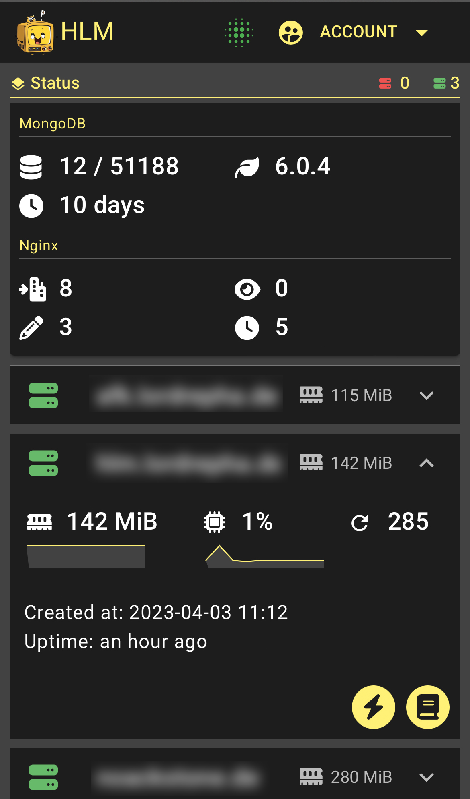
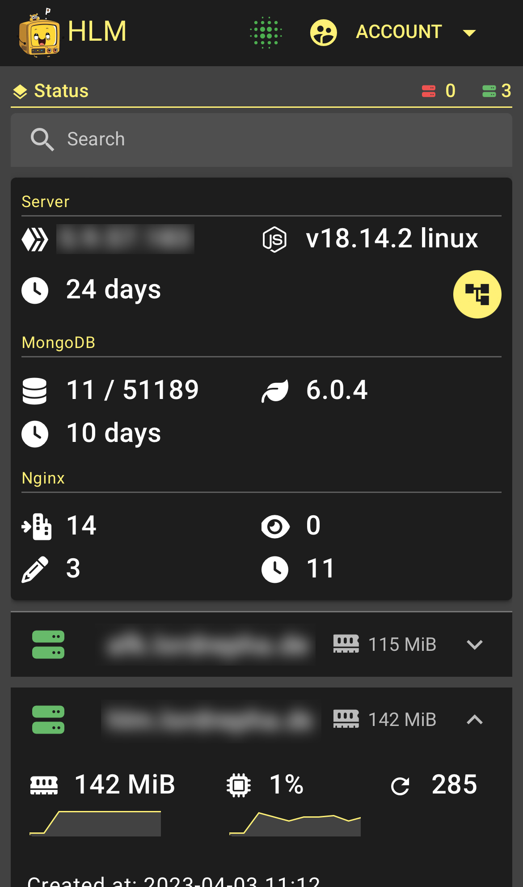

# Happy Little Monitor
is a monitoring tool for monitoring node instances started with pm2.
The code is based on the MobAPI on the server-side and on vue3 quasar.dev on the client-side.
You can observe MongoDB, Nginx, Node, PM2, Networktraffic

## Installation

1. git clone `https://github.com/lordrepha1980/Happy-Little-Monitor.git`
2. npm i
3. npm i pm2 -g (install pm2 global)
4. create a .env file in the root Folder [example](https://github.com/lordrepha1980/Happy-Little-Monitor#env)
5. Create a MongoDB Database with name `HLM`
6. Create a `user` collection and inserted a record with `{username: yourmailadress, password: yourpassword}` the password must be bcrypt like [Bcrypt](https://bcrypt-generator.com/)
7. Rename the `example.mobapi.config.js` file to `mobapi.config.js`
8. pm2 start `mobapi.config.js`
9. To get Nginx metrics, enable it in the `etc/nginx.conf` file

HLM is a quasar dev project. You can run `npx quasar build` in the public folder for a quasar build project.

## Configuration
The configuration file from the [MobAPI](https://github.com/lordrepha1980/MobAPI/blob/master/README.md#configuration) 

## .ENV

Insert your own db connection, server configuration and mail for alerts

    DEV=false
    DB_USERNAME=
    DB_PASSWORD=
    DB_HOST="localhost"
    DB_PORT=1337
    SERVER_PORT=3000
    SERVER_HOST="localhost"
    CLIENT_PORT=9000

    TEST_MAIL = ""
    MAIL_HOST = ""
    MAIL_PORT = 587
    MAIL_PASSWORD = ""

## UI

|        |        |
| ------ | ------ |
|  |  |

